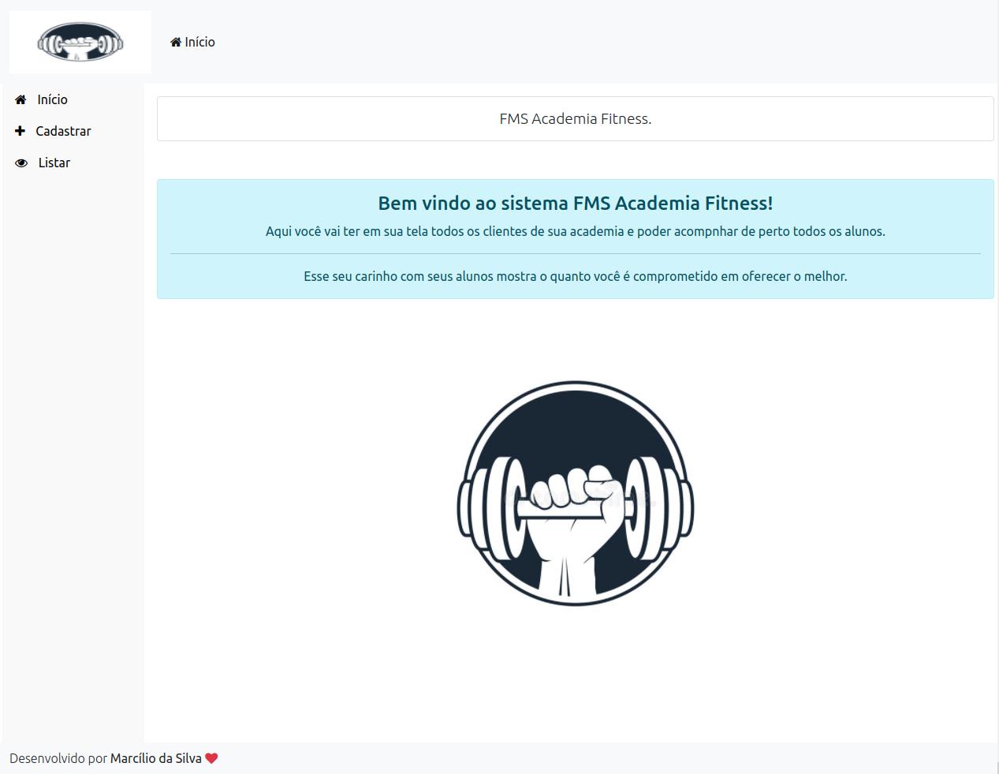
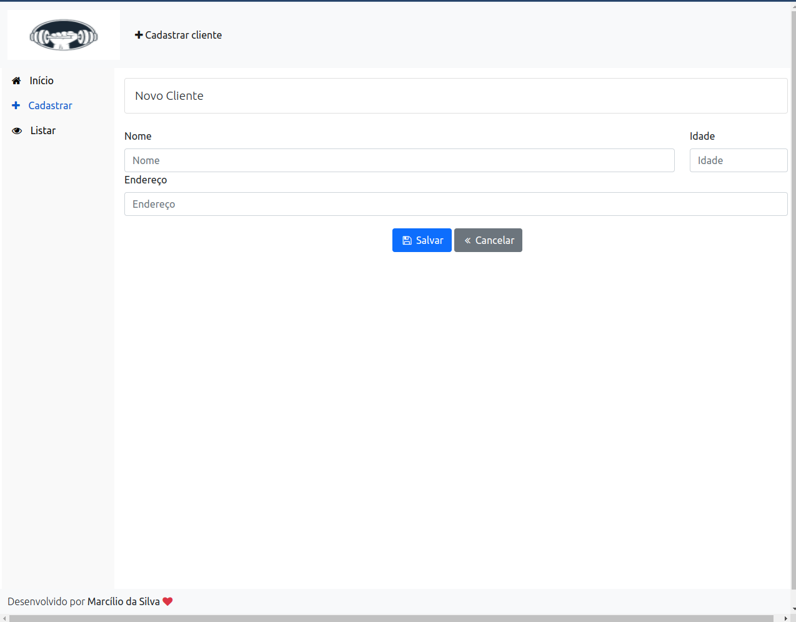
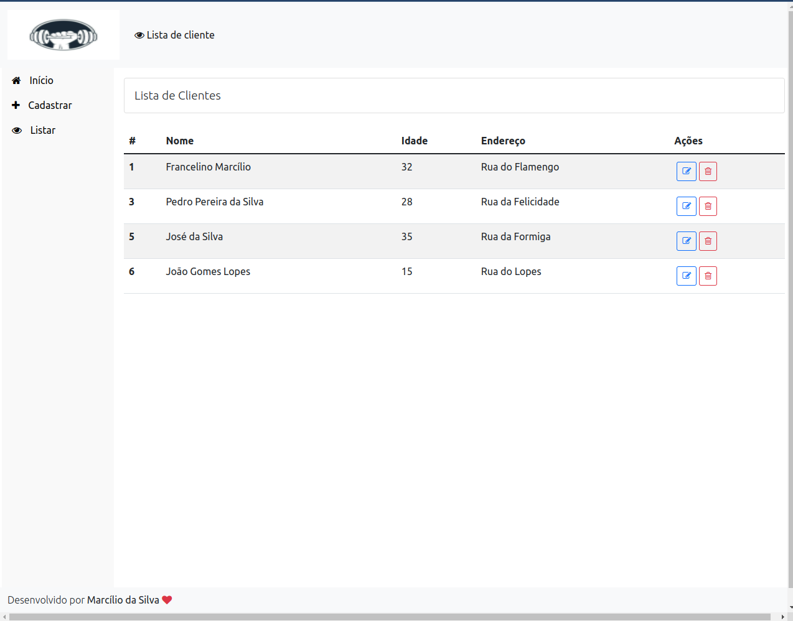
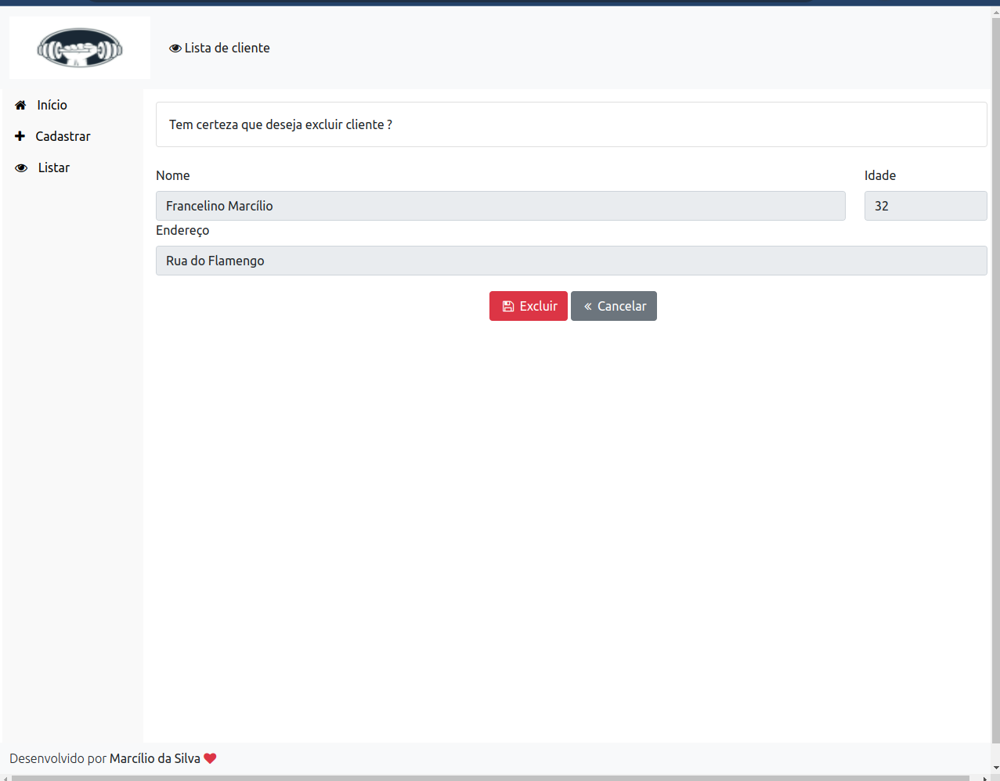

# FmsAcademiaFitness

<h1>
  
  
  
  
</h1>

---

## Indice

- [FmsAcademiaFitness](#fmsacademiafitness)
  - [Indice](#indice)
  - [Sobre](#sobre)
  - [Funcionalidade da Aplicação](#funcionalidade-da-aplicação)
  - [Tecnologias utilizadas](#tecnologias-utilizadas)
  - [Como baixar o projeto](#como-baixar-o-projeto)
  - [Autor](#autor)
  
---

## Sobre 

O Projeto **Fms Academia Fitness** foi desenvolvido como parte de uma atividade da mentoria **Conquiste sua vaga** que tem o principal objetivo: Treinar o HTML, CSS, Bootstrap 5 e JavaScript/TypeScript e colocar em prática as melhores práticas do Angular, além de desenvolver/treinar o raciocínio lógico.

O projeto é um website simples onde o usuário pode cadastrar, visualizar, editar/atualizar, excluir (CRUD) de seus clientes de uma academia. As funcionalidade estão toda em acordo. O próximo passo será melhorar a aplicação e continuar desenvolvendo as melhores práticas.


---

## Funcionalidade da Aplicação

A aplicação exemplo consiste em criar um simples gerenciador de clientes da academia
com as seguintes funcionalidades:
- Criar cliente para o sistema
- Atualizar informações do usuário
- Remover usuário
- Listar todos os usuários

---
## Tecnologias utilizadas 

O projeto foi desenvolvido utilizando as seguintes tecnologias
- [Angular 12](https://angular.io/)
- [Bootstrap 5](https://getbootstrap.com/docs/5.0/getting-started/introduction/)
- JavaScript
- TypeScript
- HTML
- CSS

---

## Como baixar o projeto

```bash
# Clonar o repositório em sua máquina 
$ git clone https://github.com/francelinom/FMS-Academia-Fitness-.git

# Entrar na pasta do projeto 
$ cd FMS-Academia-Fitness-

# Instalar todas as dependências 
$ npm i

# Iniciar o projeto 
$ ng serve
```
---
## Autor

Desenvolvido por **Francelino Marcílio da Silva** 
<h1>
  
</h1>
